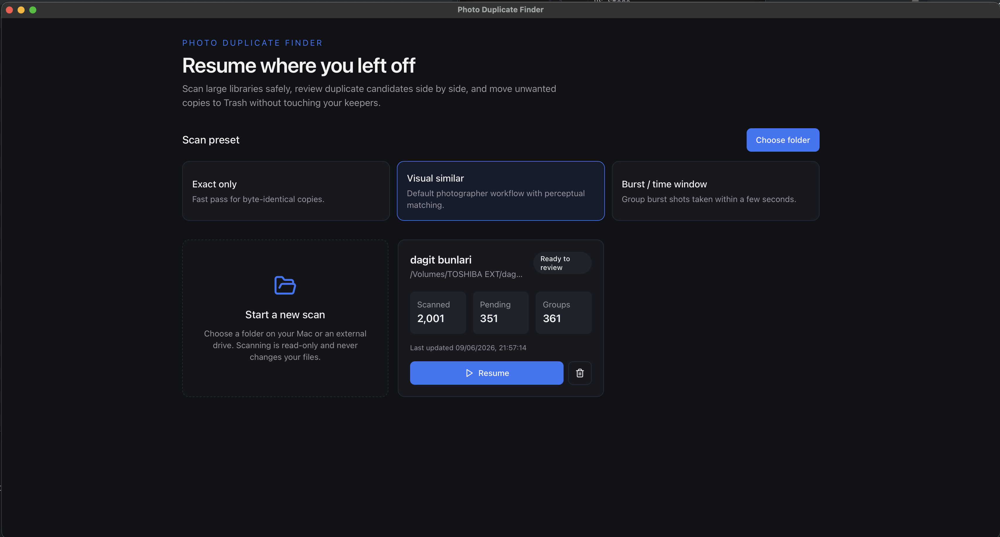
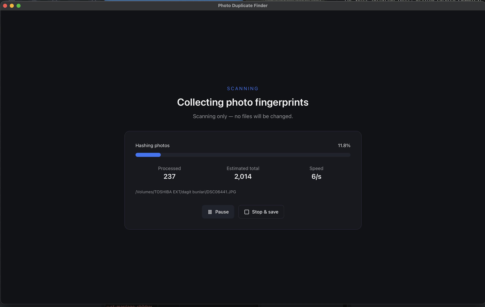
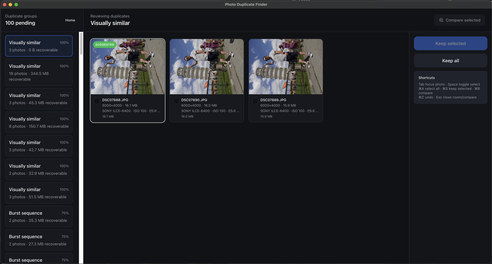

# Photo Duplicate Finder

macOS desktop app for finding and reviewing duplicate photos in large libraries. Built with Rust (scan engine), Tauri 2, React 19, and Tailwind CSS 4.

## Screenshots

| Home | Scanning | Review |
| --- | --- | --- |
|  |  |  |

## Features

- Scan folders on internal or external drives (read-only indexing)
- Scan presets: exact only, visual similar (default), or burst / time window
- Resume interrupted scans and review sessions later
- Pause or stop mid-scan and save progress
- Multi-tier duplicate detection:
  - Exact copies (BLAKE3)
  - Visually similar images (dHash + pHash with LSH bucketing)
  - Burst sequences (EXIF time window)
- Optionally incude raw files with same names
- Review UI with tiled groups, zoom, multi-photo compare slider
- Easy short cuts,
  - loop focusing photos: tab
  - select focused: space
  - select all: cmd+a
  - save(trash unselected): cmd+s
  - compare selected: cmd+b  
- Keep selected / keep all, then move rest to macOS Trash
- Photographer metadata: filename, dimensions, dates, ISO, aperture, shutter, focal length

## Prerequisites

- [Rust](https://www.rust-lang.org/tools/install)
- [Node.js 22+](https://nodejs.org/)
- macOS 12+

Install Tauri prerequisites: https://tauri.app/start/prerequisites/

## Development

```bash
make install
make dev
```

## Build

```bash
make build
```

## Test

```bash
make test
```

## Verify the app

1. Run `make dev`
2. Click **Choose folder** and select a directory with known duplicate photos
3. Wait for the scan to finish (progress shows files/sec and phase)
4. Review duplicate groups in the tiled grid
5. Select photos to keep, then click **Keep selected** (unselected copies go to Trash)
6. Quit the app and reopen — your session appears on the home screen with **Resume**
7. Multi-select photos and use **Compare selected** for the zoom slider

## Data location

Application data is stored at:

`~/Library/Application Support/photo-duplicate-finder/`

- `index.db` — SQLite index of scanned files and duplicate groups
- `thumbs/` — generated thumbnail cache

Deleting a session from the home screen removes database records only; your photo files are never deleted unless you explicitly move duplicates to Trash during review.

## Architecture

```
React UI (Tauri webview)
    ↓ invoke / events
Tauri commands
    ↓
scan-engine (jwalk, BLAKE3, image_hasher, rusqlite)
```

## Notes

- Photos Library (`.photoslibrary`) is not opened directly in v1 — export or select a subfolder
- Scanning large libraries (100k+ files) is designed for incremental resume and WAL-backed SQLite writes
